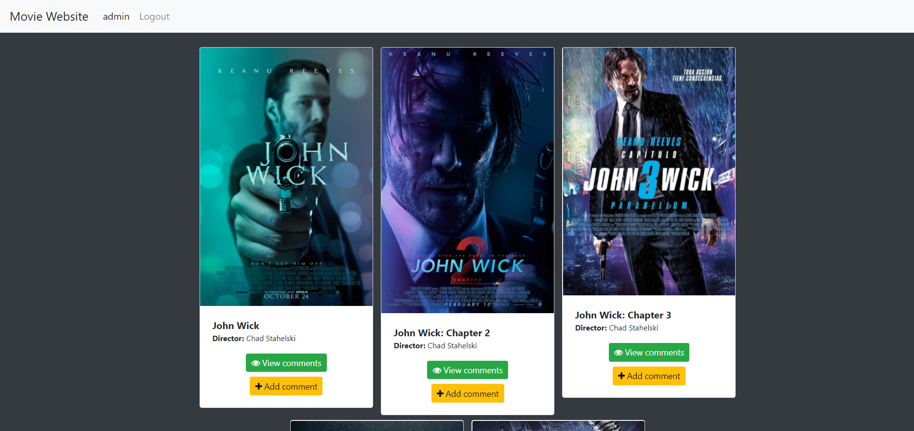
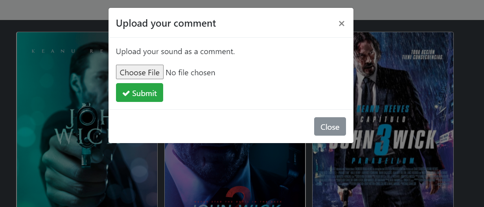
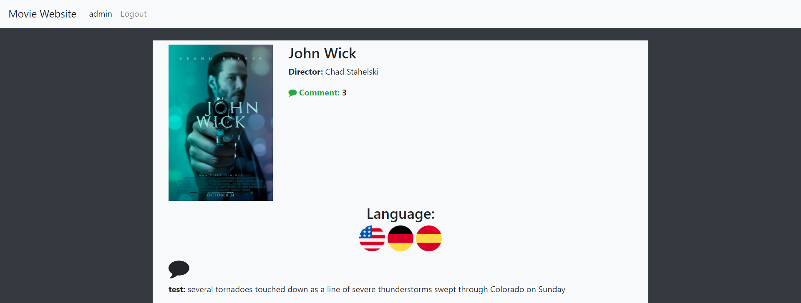
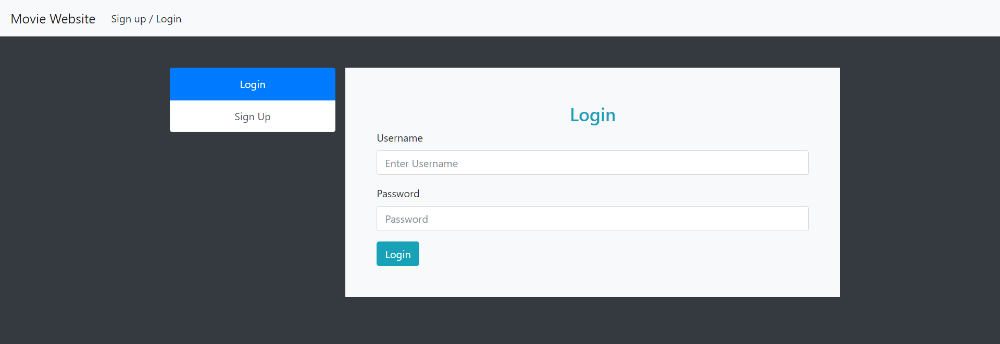

# Cloud computing first assignment
## A brief introduction
This is the first assignment of the cloud computing course. The main ideas are:
- Created a simple website using the Django framework.
- Using IBM cloud services to comment on the movies.
   - **Speech to text**: user has to send his comment by sending a recorded voice. Then, by passing the voice to the IBM
     Speech2text service, it is converted to text.
   - **Natural language processing**: We need to process the text, and if it's not aggressive, we store it on the
     database. To do that, we also used an IBM service on the cloud.
   - **Comment translation**: The comments are visible in three different languages. English, German, and Spanish. For
    English, the comments are directly read from the database, but for the other two languages, after making a query, the 
    comment is sent to one of IBM cloud services, and the translated message is shown on the webpage. 
     
**Note**: For security purposes, `settings.py` is not available on this repository since secret and API keys are there. 
## Screenshots

